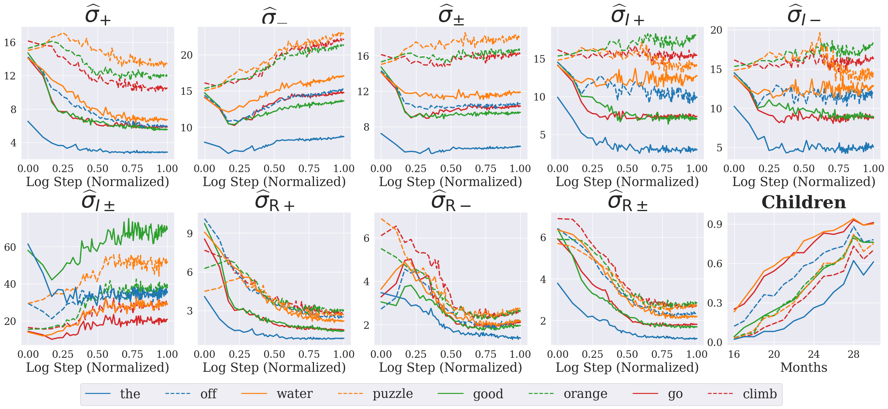

# A Distributional Perspective on Word Learning in Neural Language Models

This is the code used to perform the analysis on word learning done in the [paper]().

# How to run
Run setup.sh to setup your venv.

Run everything from the base folder of the project and make sure to export the PYTHONPATH

```bash
export PYTHONPATH=${PYTHONPATH}:$(pwd)
```

All the configs used to run the scripts are located in `configs/`

## Children Data - Word bank

To get all the results for WordBank download the proportion file from [Wordbank website](http://wordbank.stanford.edu/data/?name=item_data) and then run:

```bash
python3 scripts/children/run_wordbank.py config=configs/wordbank/run_wordbank.yaml
```


To get the results step by step, read the following sections.


### Data

The code in `src/wordbank/get_child_aoa.R` was used to get the Age of Acquisition of children from [Wordbank (Frank et al.)](https://www.cambridge.org/core/journals/journal-of-child-language/article/abs/wordbank-an-open-repository-for-developmental-vocabulary-data/977D930531B5318CA976CD8582D9F401).

To get the data run

```bash
Rscript src/wordbank/get_child_aoa.R src/wordbank/data/all_prop_data_WS_hex.tsv
```


The data are then cleaned using the code in [Chang and Bergen](https://github.com/tylerachang/word-acquisition-language-models/blob/main/scripts/clean_wordbank_words.py).

To clean run the following command:

```bash
python3 src/wordbank/clean_worbank_word.py --input_file src/wordbank/data/all_prop_data_WS_hex.tsv  --output_file src/wordbank/data/clean_wordbank_american.tsv
```

The results can be found in `src/wordbank/data/clean_wordbank_american.tsv`.

The proportion of children for each word in American English is downloaded from [Wordbank website](http://wordbank.stanford.edu/data/?name=item_data).


### AoA plot

We used `src/wordbank/data/clean_wordbank_american.tsv` and `src/wordbank/data/child_american_proportion.csv` to plot the learning curves of the children for  "English (American)".

The words with $AoA \gt 30 \ \vee AoA \lt 16$ and for which $\min(proportios) \gt 0.5 \vee \max(proportion) \lt 0.5$ were discarded.

The plots can be found in `src/wordbank/images`. To get the the plots run the code

```bash
python3 src/wordbank/plot_child_aoa.py --input_dir <input_dir> --output_dir <output_dir>
```

The other files, 
`src/wordbank/data/childes_eng-na.tsv, src/wordbank/data/concreteness_data.tsv`
are taken from [Chang and Bergen](https://github.com/tylerachang/word-acquisition-language-models/blob/main/scripts/clean_wordbank_words.py).


Childes data taken from [Chang and Bergen](https://github.com/tylerachang/word-acquisition-language-models/blob/main/scripts/clean_wordbank_words.py) are taken from the [The Childes project, MacWhinney, Brian](https://childes.talkbank.org) and the concreteness data from [Brysbaert et al., 2014](https://link.springer.com/article/10.3758/s13428-013-0403-5).


### !! NOTE !!
**At the time of publication, Wordbank script doesn't work anymore since the R package has been deprecated.**


## Training data and models training

We use the code developed by Ionut Constantinescu ([Github](https://github.com/iconstantinescu/lm-critical-period)) adapted for our purposes.
The training data is the Unified Dataset as presented in his [paper](https://arxiv.org/abs/2407.19325). The second dataset used is the 100M track of [BabyLM](https://babylm.github.io) and CHILDES subportion of BabyLM.


We train just on language1=en. The data should be located in `lm-critical-period/data/{dataset}/raw/en`

Train the tokenizer with the following command:
```bash
cd lm-critical-period
./scripts/train_tokenizer.sh
```
To train the model run:

```bash 
./scripts/train.sh -n <model_name> -d {dataset} -t <model_name>_tokenizer -f <config_file> -s <seed>
```

We used 3 different seeds: 42, 123, 28053.

## LM Data

We used BabyLM test set to extract the positive and negative contexts. To do so run 
```bash
./scripts/preprocess/create_analysis_dataset.sh
```

Now that we have the test set we can proceed on computing our *distributional signatures*.

## Distributional Signatures


Example of the 9 distributional signature + curves.

### Get probabilities

To get probabilities just run
```bash
./scripts/probabilities/compute_probabilities.sh -m <model_folder> -n <model_name> -s <seed>
```

where `model_folder` is the folder that contains the checkpoints.

The probabilities are extracted by using [minicons](https://github.com/kanishkamisra/minicons) as described in [minicons: Enabling Flexible Behavioral and Representational Analyses of Transformer Language Models](https://arxiv.org/abs/2203.13112).

All the other parameters need to be passed through `configs/probabilities/run_probabaility_<model>.yaml`

A table with, for each context, $p(w)$ and $p(w|c)$ will be created after you run the command above. These probabilities will be used in the computation of the signatures.


### Get signatures

To compute the value for the signatures *true, intrinsic* and *extrinsic* run the following commands:

```bash
./scripts/pipelines/compute_corpus_surprisal.sh
./scripts/pipelines/compute_intrinsic.sh
./scripts/pipelines/compute_extrinsic.sh
```

After you compute the signatures you can extract AoA by simply running
```bash
./scripts/aoa/get_aoa.sh
```
The extracted AoA can be found in `src/signatures/results/signatures_aoa.parquet`

# Regression
To run the linear regression run the following 3 R scripts
```bash
Rscript src/regressions/children_regression.r "{aoa_path}" "{regression_results}/children_regression.csv" "{regression_results}/acquired_words_children.csv"

Rscript src/regressions/lm_regression.r "{aoa_path}" "{regression_results}/lm_regression.csv" "{regression_results}/acquired_words_lm.csv" "{regression_results}/converged_words_lm.csv"  "{regression_results}/lm_regression_results.csv"

Rscript src/regressions/children_regression.r "{aoa_path}" "{regression_results}/lm_to_children_regression.csv" "{regression_results}/lm_to_children_regression_results.csv" 
```
This will save the results for the regression analysis on the extracted AoA.


